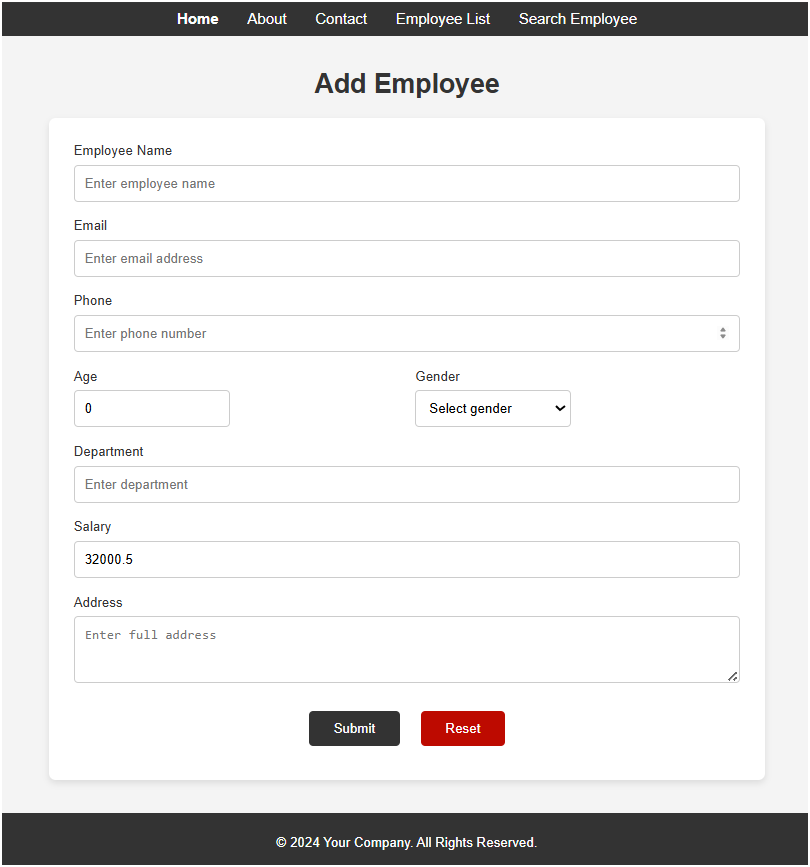
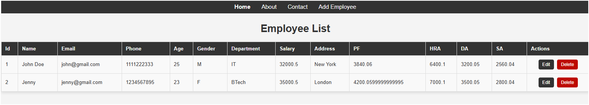

<<<<<<< HEAD
 
=======
>>>>>>> a440303ea0a72281fd9389d21765767a5117b4ff
# Employee Management System

Welcome to the **Employee Management System**! This is a web-based application developed using **Spring Boot MVC** to simplify employee data management. It provides user-friendly features for managing employee records, searching employees, and organizing them into departments.

---

## 📋 Features

- **Manage Employee Records**: Add, update, or delete employee details.
- **Search Functionality**: Find employees by name, department, or role.
- **Department Management**: Organize employees into departments for better structure.
- **Streamlined Workflow**: Simplifies HR tasks and boosts organizational productivity.
- **User-Friendly Design**: Responsive and intuitive interface for seamless navigation.

---

## 🔧 Technologies Used

- **Backend**: Spring Boot (MVC Architecture)
- **Frontend**: HTML, CSS, JavaScript, Bootstrap
- **Database**: H2 Database (In-Memory)
- **Tools**: Spring Tool Suite (STS), Maven
- **Version Control**: Git, GitHub

---

## 🛠️ Installation Guide

Follow these steps to set up and run the project locally:

### Prerequisites
- Java 8 or higher
- Maven
- Spring Tool Suite (or any IDE)
- Git

### Steps
1. Clone the repository:
   ```bash
<<<<<<< HEAD
   git clone https://github.com/Yugal-kosamshile/Emp-Management_mvc_project.git 
=======
   git clone https://github.com/your-username/employee-management-system.git
>>>>>>> a440303ea0a72281fd9389d21765767a5117b4ff
   ```
2. Navigate to the project directory:
   ```bash
   cd employee-management-system
   ```
3. Build the project using Maven:
   ```bash
   mvn clean install
   ```
4. Run the application:
   ```bash
   mvn spring-boot:run
   ```
5. Access the application in your browser at:
   ```
<<<<<<< HEAD
   http://localhost:8080
=======
   http://localhost:8082
>>>>>>> a440303ea0a72281fd9389d21765767a5117b4ff
   ```

---

## 📂 Project Structure

```
employee-management-system/
├── src/
│   ├── main/
│   │   ├── java/
│   │   │   └── com.example.employee/  # Application Code
│   │   ├── resources/
│   │   │   ├── static/                # Static Assets (CSS, JS)
│   │   │   ├── templates/             # Thymeleaf Templates
│   │   │   └── application.properties # Configuration
│   ├── test/                          # Test Cases
├── pom.xml                            # Maven Configuration
└── README.md                          # Project Documentation
```

---

## 🚀 Key Endpoints

- **Home Page**: `/`
- **Employee List**: `/employees`
- **Add Employee**: `/employees/add`
- **Update Employee**: `/employees/update/{id}`
- **Delete Employee**: `/employees/delete/{id}`

---

## 📸 Screenshots

### Home Page
<<<<<<< HEAD


### Employee List


### Add Employee


---

=======


### Employee List


### Add Employee


---


>>>>>>> a440303ea0a72281fd9389d21765767a5117b4ff
## 📄 License

This project is licensed under the [MIT License](LICENSE).

---
